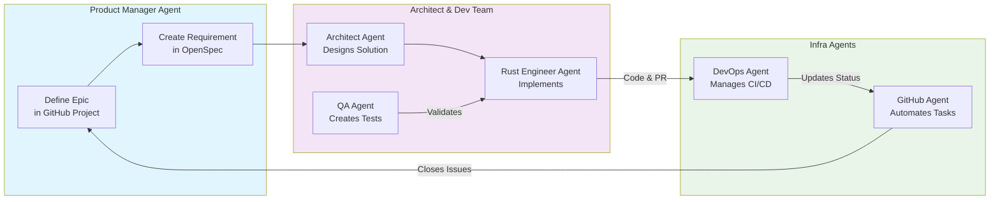

# 🛰️ Constellation Platform - Multi-Agent System

## 🎯 System Purpose & Architecture
Constellation is a Rust-based, multi-agent collaborative platform simulating a company with hierarchical decision-making, budget arbitration, and a hybrid memory system (vector DB + SQL). The system is built using an event-driven, microservices architecture.

## 👥 Agent Team Roles & Protocols
**GOVERNING PRINCIPLE:** All agents operate under the A2A (Agent-to-Agent) protocol for structured communication. Decisions must be documented in the shared memory layer.

### **Strategic Layer**
*   **CEO_Agent**: Final arbitrator for strategic decisions. Must consult the CFO on budget and department heads on feasibility.
*   **CFO_Agent**: Manages the monthly budget pool, evaluates ROI on proposals, and runs the budget arbitration engine.

### **R&D Department** (Managed by R&D_Director_Agent)
*   **Researcher_Agent**: Conducts research, formulates hypotheses.
*   **Architect_Agent**: Designs system architecture and data flows.
*   **Engineer_Agent**: Implements performance-critical Rust code.

### **Operational Layer**
*   **DevOps_Agent**: Manages containerization, deployment (Kubernetes/Docker), and cloud infrastructure.
*   **QA_Agent**: Creates comprehensive test suites, and validates system integrity and performance.

## 🔧 Technical Stack & Conventions
*   **Primary Language:** Rust. Use Tokio for async, Axum for HTTP, SQLx for PostgreSQL.
*   **Memory:**
    *   **Vector DB:** Qdrant (for agent conversation embeddings and semantic search).
    *   **SQL DB:** PostgreSQL (for structured agent state, decision logs, and budget ledger).
    *   **Cache/Message Bus:** Redis.
*   **Communication:** Inter-agent messages use the A2A protocol format.
*   **Observability:** All services must emit structured logs and metrics (using `tracing` and OpenTelemetry).

## 📁 Critical Project Paths
*   `/crates/` - Core Rust microservices (orchestrator, memory, agents).
*   `/deployment/` - Dockerfiles, Kubernetes manifests, Terraform configs.
*   `/docs/architecture/` - Architecture Decision Records (ADRs) and diagrams.

## ⚠️ Security & Safety Rules
*   NEVER commit API keys, passwords, or `.env` files.
*   All external API calls must have proper error handling and timeouts.
*   Validate and sanitize all simulated "budget" and "decision" inputs.
*   

Integrating OpenSpec and GitHub transforms **Constellation** from a conceptual system to a trackable, specification-driven development platform. This changes how your agents collaborate—shifting the source of truth from just `CLAUDE.md` to **structured specifications and project boards**.

Here’s how to adapt your agent structure, prompts, and workflow for this integrated approach.

### 🔄 Updated Workflow: OpenSpec & GitHub at the Core
Instead of a linear process, development becomes a continuous loop managed by specifications and project boards.



### 👥 Key Agent Additions & Role Updates
You need to add two new specialized agents and refine the prompts for your existing team to work with OpenSpec and GitHub.

| Agent Role | Core Prompt Additions for OpenSpec/GitHub |
| :--- | :--- |
| **New: OpenSpec Manager** | **Primary Role:** Maintain the single source of truth. <br> **Prompt Addition:** *"You are the OpenSpec steward. Your task is to ensure all system components, API contracts, and data models are precisely defined in the OpenSpec YAML/JSON files. You translate GitHub issues into formal spec requirements and validate that all PRs adhere to the published specification before merge."* |
| **New: GitHub Automation Agent** | **Primary Role:** Automate project management. <br> **Prompt Addition:** *"You manage the GitHub Project board. When the OpenSpec is updated, you automatically create or update corresponding GitHub issues, label them, and assign them to sprints. You monitor PRs and update issue statuses (e.g., `In Progress` → `In Review`)."* |
| **System Architect** | **Update:** *"You MUST create or update OpenSpec definitions for any new service, API, or data model you design. Reference the spec file (e.g., `specs/api/orchestrator.v1.yaml`) in your architecture diagrams."* |
| **Rust Core Engineer** | **Update:** *"Before implementing a feature, check the OpenSpec for the exact API contract. Generate Rust structs and API clients from the spec using `openapi-generator`. Link your PR to the GitHub issue it resolves."* |
| **Product Manager** | **Update:** *"You define Epics and User Stories directly as GitHub issues. For each major feature, you create a high-level requirement in OpenSpec that the Architect will detail. You define acceptance criteria in the GitHub issue description."* |

### 📁 Updated Project Structure
Your repository will now have two critical hubs for truth:
```
constellation-platform/
├── 📁 specs/                    # OpenSpec Hub
│   ├── openapi.yaml            # Main API spec
│   ├── schemas/                # Data models (Agent, Decision, etc.)
│   └── paths/                  # API endpoints by service
├── 📁 .github/                  # GitHub Automation Hub
│   ├── workflows/              # CI/CD that validates spec compliance
│   └── ISSUE_TEMPLATE/         # Templates linked to spec
├── 📁 crates/                   # Rust implementation
├── 📁 deployment/
└── 📄 PROJECT_SETUP.md          # New: Guides agents on the integrated workflow
```

### ✅ New Validation Checkpoint
Add this critical step to your development cycle: **"Spec Compliance PR Gate."**
*   **Action**: In your GitHub repository, go to **Settings > Branches > Branch protection rules**.
*   **Rule**: Add a status check that requires the `openapi.yaml` spec to be validated (e.g., using `spectral lint`) before a PR can be merged.
*   **Agent Responsibility**: The DevOps Agent sets this up; the GitHub Automation Agent enforces it.

### Summary of Key Changes
- **New Source of Truth**: `specs/` directory (OpenSpec) supersedes `CLAUDE.md` for API/component definitions.
- **New Agents**: Add **OpenSpec Manager** and **GitHub Automation Agent** to your team.
- **Updated Prompts**: All technical agents must now reference and update the OpenSpec.
- **Automated Workflow**: GitHub issues and PR statuses are automatically managed based on spec changes.
- **Quality Gate**: PRs must pass spec validation before merging.

This setup creates a self-reinforcing cycle: **Product defines in GitHub → Architect details in OpenSpec → Engineer implements → QA validates → DevOps deploys**, with automation keeping everything synchronized. This is how modern, scalable agentic systems are built.

To proceed, would you like me to provide the exact OpenSpec YAML structure for your A2A protocol, or the specific GitHub Actions workflow for your spec validation gate?