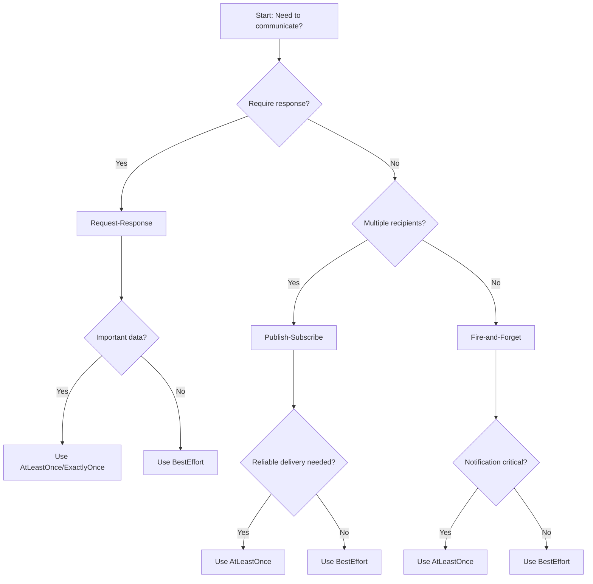

# Pattern Selection Decision Guide

This guide helps you choose the right communication pattern for your agent interactions.

## Overview

Constellation provides three main communication patterns:

1. **Request-Response**: Synchronous communication with guaranteed response
2. **Publish-Subscribe**: Asynchronous broadcast to multiple subscribers
3. **Fire-and-Forget**: One-way notification without response expectation

## Decision Tree



## Pattern Comparison

| Pattern | Use Case | Delivery Guarantee | Response Expected | Multiple Recipients | Complexity |
|---------|----------|-------------------|-------------------|-------------------|------------|
| **Request-Response** | Query data, RPC calls, command execution | Configurable (BestEffort to ExactlyOnce) | Yes | No | Medium |
| **Publish-Subscribe** | Event broadcasting, system notifications, state updates | Configurable (BestEffort to AtLeastOnce) | No | Yes | High |
| **Fire-and-Forget** | Logging, metrics, non-critical notifications | Configurable (BestEffort to AtLeastOnce) | No | No | Low |

## Detailed Guidelines

### When to Use Request-Response

**Use Request-Response when:**
- You need a response from the recipient
- You're executing a command that requires confirmation
- You're querying data from another agent
- You need synchronous communication
- Transactional operations where success/failure matters

**Examples:**
- Asking another agent for its current status
- Requesting data from a database agent
- Sending a command and waiting for completion confirmation
- Authentication/authorization requests

**Configuration Tips:**
- Use `AtLeastOnce` or `ExactlyOnce` for important requests
- Set appropriate timeouts based on expected response time
- Use retries for transient failures
- Consider priority levels for time-sensitive requests

### When to Use Publish-Subscribe

**Use Publish-Subscribe when:**
- Multiple agents need to receive the same message
- You're broadcasting events or state changes
- Implementing event-driven architecture
- Building notification systems
- Creating decoupled, scalable systems

**Examples:**
- System health status updates
- Configuration changes
- New data available notifications
- Agent lifecycle events (started, stopped, failed)
- Market data feeds in trading systems

**Configuration Tips:**
- Use topic hierarchies for organization (e.g., `system.health`, `data.updates`)
- Consider wildcard subscriptions for related topics
- Use `AtLeastOnce` for important events
- Monitor subscription counts and message delivery rates
- Implement dead letter queues for undeliverable messages

### When to Use Fire-and-Forget

**Use Fire-and-Forget when:**
- You don't need a response
- The operation is non-critical
- You're sending metrics or logs
- Implementing best-effort notifications
- Reducing latency is important

**Examples:**
- Sending telemetry data
- Logging agent activities
- Non-critical status updates
- Heartbeat signals
- Debug/trace information

**Configuration Tips:**
- Use `BestEffort` for non-critical notifications
- Consider message TTL to prevent queue buildup
- Monitor delivery failure rates
- Use lower priorities for non-urgent notifications
- Implement circuit breakers for persistent failures

## Delivery Guarantee Selection

### BestEffort
- **When to use**: Non-critical data, metrics, logs
- **Pros**: Lowest latency, minimal overhead
- **Cons**: May lose messages during failures
- **Example**: `DeliveryGuarantee::BestEffort`

### AtLeastOnce
- **When to use**: Important notifications, event broadcasting
- **Pros**: Guaranteed delivery, handles retries
- **Cons**: Possible duplicates, higher latency
- **Example**: `DeliveryGuarantee::AtLeastOnce`

### AtMostOnce
- **When to use**: Time-sensitive data where duplicates are problematic
- **Pros**: No duplicates, reasonable latency
- **Cons**: May lose messages during failures
- **Example**: `DeliveryGuarantee::AtMostOnce`

### ExactlyOnce
- **When to use**: Critical operations, financial transactions
- **Pros**: Guaranteed delivery, no duplicates
- **Cons**: Highest latency, most overhead
- **Example**: `DeliveryGuarantee::ExactlyOnce`

## Priority Selection

### Critical
- **When to use**: System alerts, failure notifications, security events
- **Example**: `MessagePriority::Critical`

### High
- **When to use**: Time-sensitive requests, user interactions
- **Example**: `MessagePriority::High`

### Normal
- **When to use**: Regular operations, most business logic
- **Example**: `MessagePriority::Normal`

### Low
- **When to use**: Background tasks, non-urgent notifications
- **Example**: `MessagePriority::Low`

## Code Examples

### Request-Response Example
```rust
use constellation_agent_sdk::{AgentClient, AgentConfig, DeliveryGuarantee};
use tokio::time::Duration;

let config = AgentConfig::default()
    .with_agent_id("query_agent")
    .with_broker_url("127.0.0.1:8090");

let client = AgentClient::connect(config).await?;

// Important query - use AtLeastOnce guarantee
let response = client.request(
    "database_agent",
    "SELECT * FROM users WHERE active = true",
    Duration::from_secs(30),
    DeliveryGuarantee::AtLeastOnce,
    MessagePriority::Normal,
).await?;
```

### Publish-Subscribe Example
```rust
// Subscribe to system events
client.subscribe("system.*").await?;

// Publish a system event
client.publish(
    "system.health",
    r#"{"status": "healthy", "timestamp": "2024-01-01T00:00:00Z"}"#,
    DeliveryGuarantee::AtLeastOnce,
    MessagePriority::Normal,
).await?;
```

### Fire-and-Forget Example
```rust
// Send metrics - best effort is sufficient
client.notify(
    "metrics_collector",
    r#"{"agent": "my_agent", "cpu_usage": 45.2, "memory_mb": 128}"#,
    DeliveryGuarantee::BestEffort,
    MessagePriority::Low,
).await?;
```

## Performance Considerations

### Latency
1. **Fire-and-Forget**: Lowest latency (no waiting for response)
2. **Publish-Subscribe**: Medium latency (fan-out to subscribers)
3. **Request-Response**: Highest latency (waiting for response)

### Throughput
1. **Fire-and-Forget**: Highest throughput (no blocking)
2. **Publish-Subscribe**: Medium throughput (fan-out overhead)
3. **Request-Response**: Lowest throughput (synchronous waiting)

### Resource Usage
1. **Request-Response**: Highest (maintains connection for response)
2. **Publish-Subscribe**: Medium (manages subscriptions)
3. **Fire-and-Forget**: Lowest (simple send operation)

## Monitoring and Observability

### Key Metrics to Monitor

**For all patterns:**
- Message delivery success rate
- Latency percentiles
- Error rates by type

**Request-Response specific:**
- Response time distribution
- Timeout rate
- Retry count distribution

**Publish-Subscribe specific:**
- Active subscription count
- Messages delivered per subscription
- Subscription churn rate

**Fire-and-Forget specific:**
- Delivery failure rate
- Message age in queue
- Queue depth

### Alerting Recommendations

1. **Critical alerts**:
   - Delivery failure rate > 5%
   - Average latency > 1 second
   - Queue depth > 1000 messages

2. **Warning alerts**:
   - Delivery failure rate > 1%
   - Average latency > 500ms
   - Queue depth > 500 messages

## Common Anti-Patterns

### ❌ Don't use Request-Response for:
- Broadcasting to multiple agents (use Publish-Subscribe)
- Non-critical notifications (use Fire-and-Forget)
- High-volume logging (use Fire-and-Forget with BestEffort)

### ❌ Don't use Publish-Subscribe for:
- Point-to-point communication (use Request-Response or Fire-and-Forget)
- Operations requiring immediate response (use Request-Response)

### ❌ Don't use Fire-and-Forget for:
- Critical operations requiring confirmation (use Request-Response)
- Transactions where delivery must be guaranteed (use Request-Response with ExactlyOnce)

## Migration Scenarios

### From Basic Messaging to Patterns

**Before (basic messaging):**
```rust
// Simple send/receive
broker.send_message(recipient, "query", payload).await?;
let response = broker.receive_messages(agent_id, 1).await?;
```

**After (pattern-based):**
```rust
// Clear intent with appropriate pattern
let response = client.request(recipient, payload, timeout, guarantee, priority).await?;
```

### From Synchronous to Asynchronous

**Synchronous (blocking):**
```rust
let result = client.request("processor", data, timeout).await?;
process_result(result);
```

**Asynchronous (non-blocking):**
```rust
// Fire-and-forget for non-critical processing
client.notify("async_processor", data, DeliveryGuarantee::AtLeastOnce).await?;
// Continue with other work
```

## Troubleshooting Guide

### Common Issues and Solutions

1. **High latency in Request-Response**:
   - Check recipient agent responsiveness
   - Adjust timeout values
   - Consider using lower delivery guarantees
   - Implement request prioritization

2. **Messages not delivered in Publish-Subscribe**:
   - Verify subscription patterns match topic
   - Check subscriber agent connectivity
   - Monitor subscription counts
   - Review delivery guarantee settings

3. **Queue buildup in Fire-and-Forget**:
   - Implement message TTL
   - Monitor consumer processing rate
   - Consider using lower priority
   - Add dead letter queue handling

4. **Duplicate messages**:
   - Switch from AtLeastOnce to AtMostOnce or ExactlyOnce
   - Implement idempotent message processing
   - Add duplicate detection at application level

## Conclusion

Choosing the right communication pattern depends on your specific requirements:

- **Need responses?** → Request-Response
- **Multiple recipients?** → Publish-Subscribe  
- **Simple notifications?** → Fire-and-Forget

Always consider:
1. **Delivery requirements** (BestEffort vs ExactlyOnce)
2. **Performance needs** (latency vs throughput)
3. **Reliability requirements** (message loss tolerance)
4. **Monitoring capabilities** (metrics and alerting)

By following this guide, you can build robust, efficient, and maintainable agent communication systems.